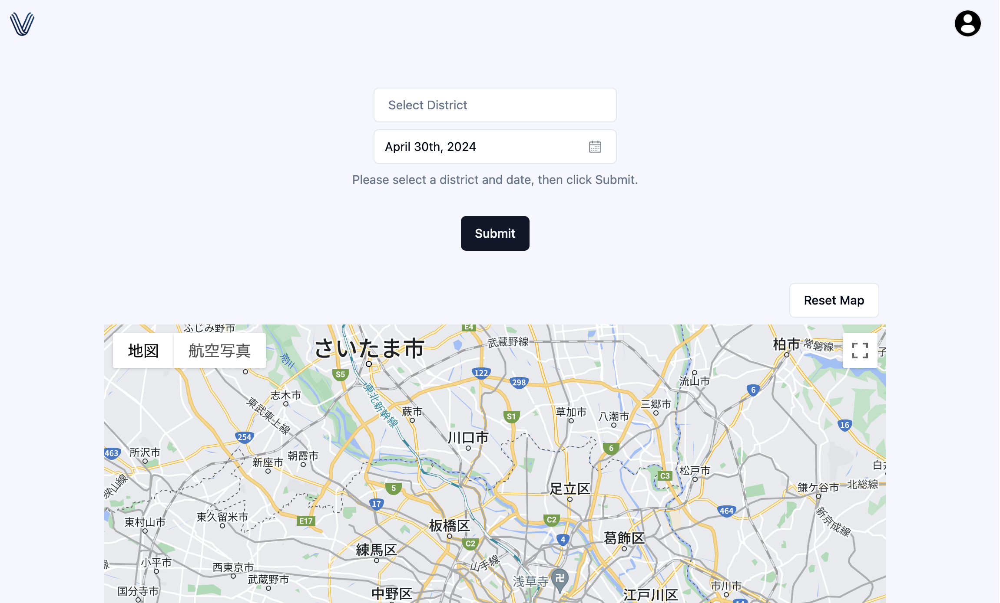

## 概要 
地名と日付を入力してボタンを押すと、ローカルイベントの情報がGooglemap上に表示される

## 機能紹介
イベント情報検索機
- webスクレイピング
- Googlemapにピンを立ててイベント情報を表示
- Googlemap上にイベントの詳細情報をウィンドウ表示

## 使用画面
| Login | Signup | Home |
| :---: | :---: | :---: |
|  |  |  |
| Loginを実施 | Signupを実施 | イベント情報の取得 |
| Google | Google | 地名 |
| Email | Email | 日付をCalendarから選択 |

## 実行環境の構築
https://github.com/ovrsa/vex/tree/master/vex_app

## 使用技術
### Infrastructure
- Docker
- Docker Compose

### Frontend:
- vite: ^5.1.4
- react: ^18.2.0
- typescript: ^5.2.2
- react-router-dom: ^6.3.0
- shadcn: ^1.1.0
- GooglemapsJs-api: ^1.16.1
- axios: ^0.27.2
- recoil: ^0.7.7
- recoil-persist: ^5.1.0
- tailwindcss: ^2.2.1
- vaul: ^0.9.0
- zod: ^3.22.4
- supabase-js: ^2.42.5
- cors: ^2.8.5

### Backend:
- python: 3.9
- Flask: 3.0.2
- requests: 2.26.0
- beautifulsoup4: 4.10.0
- Werkzeug: 2.0
- flask-cors: 3.0.10
- pytz: 2022.1
